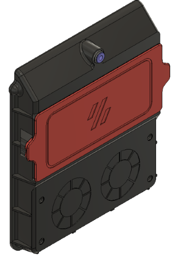
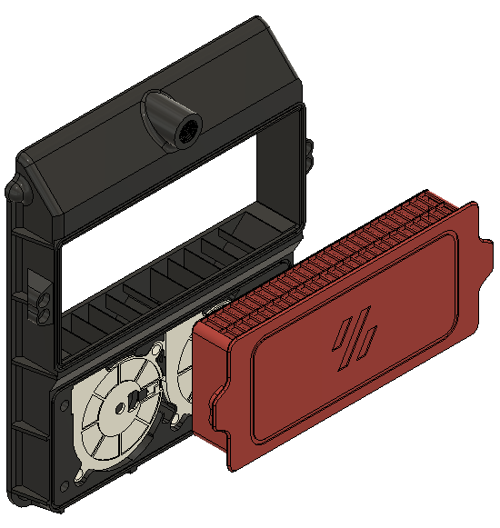

# Voron V2 Re-circulating Filter 
(rear-mounted nevermore micro duo)

Modified existing v2.2 exhaust housing to incorporate u/0ndsk4's Nevermore micro re-circulating design. Added BSP fitting for bowden tube from v2.4 and a removable drawer as a filter basket to hold carbon pellets for filtration.

Uses the same 2 5015 Blower fans from the Nevermore, and 4mm activated carbon pellets. Two holes need to be cut into the back panel (1.5" diameter) for the blower fan inlets. The housing works as a good template once it is printed. Housing attaches to back panel with VHB tape, same as v2.2/2.4 designs. Pellets need to be replaced every so often, have heard anywhere from 50-100 hours. Have not run that long myself yet.

## Hardware needed:
- 2x 5015 blower fans (confirmed fitment with Winsin brand, but same as used in nevermore micro)
- 4x 6x3mm magnet (same as used in V2 BOM)
- 6x M3x5x4 heatset inserts
- 4x m3 screws (6-8mm length OK)
- 3M VHB tape
- Approx 200g of 4mm activated carbon pellets, I bought mine here:
https://envirosupply.net/products/4mm-pellet-virgin-coal-activated-carbon-charcoal-for-vapor-filtration-1-lb-bag

## Nevermore micro:
Based on original design from 0ndsk4:
https://github.com/0ndsk4/VoronUsers/tree/0ndsk4/printer_mods/0ndsk4/Nevermore_Air_Filter/Nevermore_Micro
