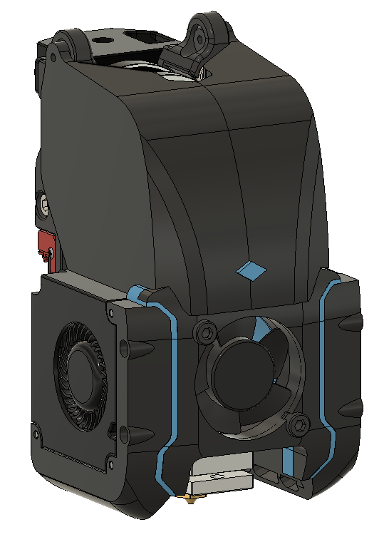

# V2.2 30mm fan Toolhead + Sherpa Mini Extruder
Codename: Tronhead

Direct drive extruder in compact packaging weighing in at 235 grams with standard steel hardware.

Modified v2.2 toolhead for tighter integration of sherpa mini extruder. Design features:

- 30 x 10mm hotend fan
- TL Dragon hotend
- New toolhead mount with exhaust flow path considerations to extract more flow from smaller fan, 5mm increase in y-travel
- Modified X-Carriage integrates LDO NEMA14 motor with backlash adjustment, forms part of exhaust exit duct
- Modified Sherpa mini extruder mounting locations for direct connection to carriage. 16mm lower stack height than current modular design. Tension screw flipped around for smaller package.
- Currently only made a inductive probe sensor version (will add quick-draw style probe carriage)
- single or dual mgn9 carriage setup (I am testing it with the standard single mgn9 first)

## Hardware needed:
- Extruder uses all the same hardware as Sherpa Mini
- X-carriage uses all the same hardware as existing v2.2 carriage.
- 30mm axial fan
- 2x 4010 radial (blower) fans
- TL / Phaetus Dragon hotend

## Sherpa Mini Extruder
Original design for this extruder from Annex Engineering:

https://github.com/Annex-Engineering/Sherpa_Mini-Extruder
