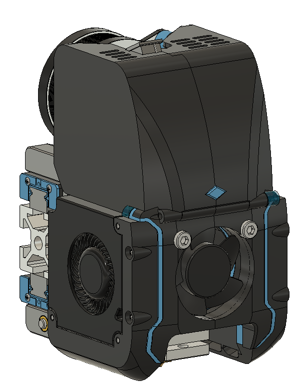
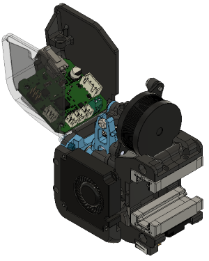

# V2 Direct Drive Toolhead
Codename: Tronhead (RC3)

Compact CoreXY toolhead with direct drive extruder and CAN board (Huvud) weighing in at 265 grams. Requires 3010 hotend fan and dragon hotend (or similar). Features integration w/ BMG gear extruder (based on ANNEX sherpa mini), Huvud PCB, and Quickdraw dockable magnetic probe.

Current version is RC3.
### RC3:

BOM:
- 30mm x 10mm axial fan (x1)
- 4010 radial (blower) fans
- Triangle Labs Dragon hotend
- LDO NEMA 14 motor
- Quickdraw Probe (Omron D2F-5 microswitch)
- Huvud toolhead PCB (optional)
- misc m3 screws (m3x30mm is the largest)
- m3x4.7x5 heatset inserts (x6)

###RC2:
There is 1 base module, with 3 carriage options:

### (1) Voron V2 - dual mgn9h with inductive probe and cable chains
- 4mm increase in y-travel, 
- ~200g lighter than Afterburner toolhead

### (2) ANNEX Redoubt - 
Redoubt dual mgn9h with dockable magnetic probe and umbilical cord
- 15mm increase in y-travel (compared to v2.4)
- dual mgn9h rail (top/bottom orientation) 
- dockable magnetic probe instead of inductive sensor
- rear mounting clamp for umbilical cord

### (3) ANNEX Redoubt + Huvud - 
Redoubt dual mgn9h + HUVUD toolhead PCB
- same but with forward folding connector cover for integration of Huvud toolhead board
- Removed mounting clamp for umbilical cord

## Hardware needed:
- Extruder uses all the same hardware as Sherpa Mini
- X-carriage uses all the same hardware as existing v2.2 carriage.
- 30mm x 10mm axial fan
- 2x 4010 radial (blower) fans
- Triangle Labs Dragon hotend
- LDO NEMA 14 motor
- inductive probe (omron) OR OR microswitch (Omron D2F-5 or similar)
- Huvud toolhead PCB (optional)

## Sherpa Mini Extruder
Original design for this extruder from Annex Engineering:

https://github.com/Annex-Engineering/Sherpa_Mini-Extruder

## Huvud Toolhead PCB
https://github.com/bondus/KlipperToolboard

## ANNEX Engineering Redoubt Project -
https://github.com/Annex-Engineering/Redoubt

You can find me on Discord with any other questions, u/moab1#9591
