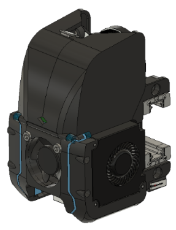

# V2 Direct Drive Toolhead
Codename: Tronhead

Compact toolhead with direct drive extruder weighing in at 265 grams with steel hardware. Features a modified sherpa mini extruder for tighter integration with hotend, 3010 fan  fan, dual 4010 part cooling fants, a dockable magnetic probe and optional Huvud toolhead PCB. 

3 Configuration Options:

### (1) Voron V2 - dual mgn9h with inductive probe and cable chains
- 4mm increase in y-travel, 
- ~200g lighter than Afterburner toolhead

(2) ANNEX Redoubt - 
Redoubt dual mgn9h with dockable magnetic probe and umbilical cord
- 15mm increase in y-travel
- dual mgn9h rail (top/bottom orientation) 
- dockable magnetic probe instead of inductive sensor
- rear mounting clamp for umbilical cord

(3) ANNEX Redoubt + HUVUD - 
Redoubt dual mgn9h + HUVUD toolhead PCB
- same but with forward folding connector cover for integration of Huvud toolhead board
- Removed mounting clamp for umbilical cord

## Hardware needed:
- Extruder uses all the same hardware as Sherpa Mini
- X-carriage uses all the same hardware as existing v2.2 carriage.
- 30mm x 10mm axial fan
- 2x 4010 radial (blower) fans
- Triangle Labs Dragon hotend
- LDO NEMA 14 motor
- omron/fotek inductive probe (if building RC1) OR mouse switch (if building RC2)
- Huvud toolhead PCB (optional for RC2)

## Sherpa Mini Extruder
Original design for this extruder from Annex Engineering:

https://github.com/Annex-Engineering/Sherpa_Mini-Extruder

## Huvud Toolhead PCB
https://github.com/bondus/KlipperToolboard

You can find me on Discord with any other questions, u/moab1#9591
