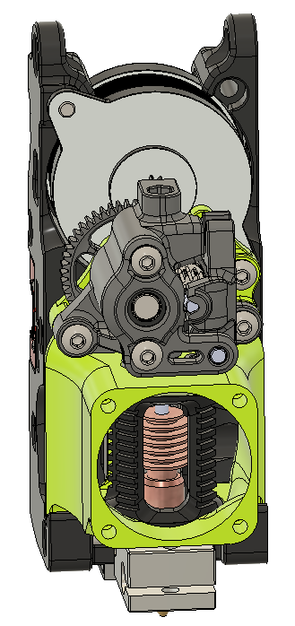

# V2.2 Toolhead
Codename: Tronhead

v2.2 toolhead for tighter integration of sherpa mini extruder
- Modified X-Carriage (single and dual mgn9 rail option) for direct mounting of Sherpa mini extruder with 16mm lower stack height, increased y-travel by 5mm
- Designed around 30mm hotend fan with Dragon hotend
- Currently only made a inductive probe sensor version
- NEMA 14 motor mounts to x-carriage and backlash is adjusted at upper mounting position (slotted).

## Hardware needed:
- Extruder uses all the same hardware as Sherpa Mini
- X-carriage uses all the same hardware as existing v2.2 carriage.
- 30mm axial fan
- 2x 4010 radial fans (same as v2.2)
- Dragon hotend
