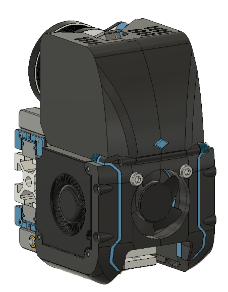
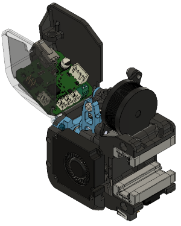

# V2 Direct Drive Toolhead
Codename: Tronhead

Compact CoreXY toolhead with direct drive extruder and CAN board (Huvud) weighing in at 285 grams. Requires 3010 hotend fan and dragon hotend (or similar). Features integration w/ BMG gear extruder (based on ANNEX sherpa mini), Huvud PCB, and Quickdraw dockable magnetic probe. Forward folding hinge on front cover for easy access.

Current version is RC3.
### RC3:

BOM:
- 30mm x 10mm axial fan (x1)
- 4010 radial (blower) fans (x2)
- Triangle Labs Dragon hotend
- LDO NEMA 14 motor
- Quickdraw Probe (Omron D2F-5 microswitch)
- Huvud toolhead PCB (optional)
- misc m3 screws (m3x30mm is the largest)
- m3x4.7x5 heatset inserts (x6)

## Sherpa Mini Extruder
Original design for this extruder from Annex Engineering:
https://github.com/Annex-Engineering/Sherpa_Mini-Extruder

## Huvud Toolhead PCB
https://github.com/bondus/KlipperToolboard

## ANNEX Engineering Quickdraw Probe -
(https://github.com/Annex-Engineering/Quickdraw_Probe)

You can find me on Discord with any other questions, u/moab1#9591
