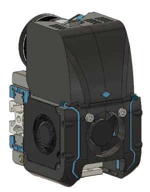

# CoreXY Integrated Toolhead
Codename: Tronhead

Compact toolhead with integrated direct drive extruder, CAN board, and dockable magnetic probe weighing in at 285 grams. Forward folding hinge on front cover for easy access. Requires 3010 hotend fan and dragon hotend. Features integration w/ BMG gear extruder (based on ANNEX sherpa mini), Huvud PCB, and ANNEX Quickdraw dockable magnetic probe. 

Current version is RC3.
### RC3:

BOM:
- 30mm x 10mm axial fan (x1)
- 4010 radial (blower) fans (x2)
- Triangle Labs Dragon hotend
- LDO NEMA 14 motor
- BMG 3mm hobbed gears and associated shafts and bearings
- ANNEX Quickdraw Probe (recommended Omron D2F-5 microswitch)
- Huvud toolhead PCB (optional)
- misc m3 screws (m3x30mm is the largest)
- m3x4.7x5 heatset inserts (x6)

## Sherpa Mini Extruder
Original design for this extruder from Annex Engineering:
https://github.com/Annex-Engineering/Sherpa_Mini-Extruder

## Huvud Toolhead PCB
https://github.com/bondus/KlipperToolboard

## ANNEX Engineering Quickdraw Probe -
(https://github.com/Annex-Engineering/Quickdraw_Probe)

You can find me on Discord with any other questions, u/moab1#9591
 
